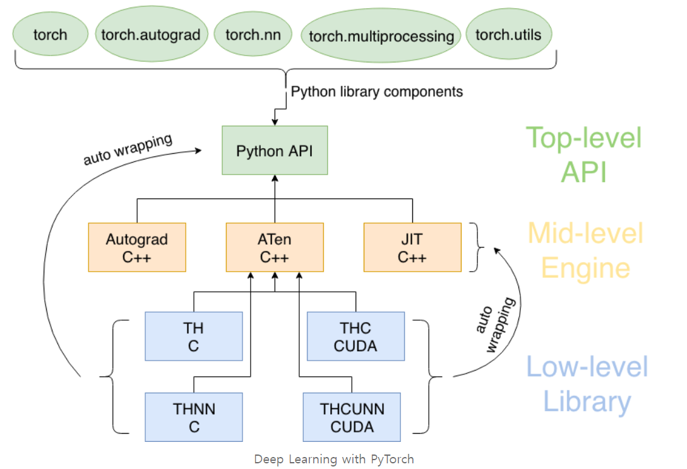
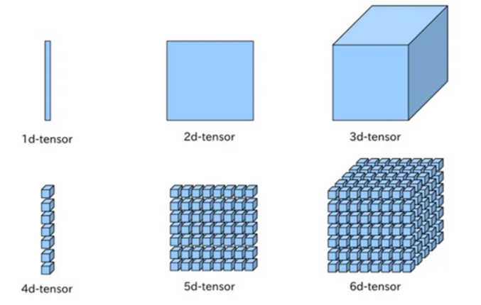

# 0. Basic

**Background**

- 루아(Lua) 로 개발된 Torch → 파이썬 버전으로 개발
- 초기에는 과학 연산을 위한 라이브러리로 공개됨 (Numpy 처럼)
- 이후 딥러닝 프레임워크로 발전 (GPU를 이용한 텐서 조작, 동적 신경망 구축)
- 유연하면서 빠른 계산

**Module Structure**

- torch: 메인 네임스페이스, 텐서 등의 다양한 수학 함수
- torch.autograd: 자동 미분
- torch.nn: 신경망 구축을 위한 데이터 구조나 레이어
- torch.multiprocessing: 병렬 처리 기능
- torch.optim: SGD(Stochastic Gradient Descent)를 중심으로 한 파라미터 최적화 알고리즘
- torch.utils: 데이터 조작 등의 유틸리티 기능
- torch.onnx: Open Neural Network Exchange, 서로 다른 프레임워크 간의 모델 공유

**Tensor**

- 데이터 표현을 위한 기본 구조
- 데이터를 담는 컨테이너로서 일반적으로 수치형 데이터를 저장
- Numpy의 ndarray 와 유사
- GPU 연산 가능

**Neural Network**

- Node → Layer → module → model