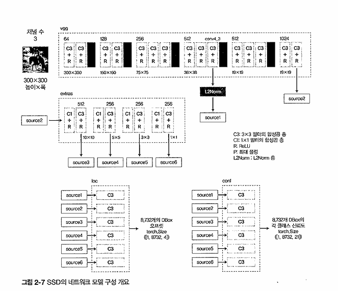

# 모델

* L2Norm: 채널 간의 정규화

---

# output 산출

* Output
1. bbox에 대한 offset 정보 (Δcx, Δcy, Δw, Δh)
2. 20개의 classes & background

vgg, extras 통과 후 loc과 conf를 이용해 output 산출

source 1 = 38 × 38
source 2 = 19 × 19
source 3 = 10 × 10
source 4 = 5 × 5
source 5 = 3 × 3
source 6 = 1 × 1 
sum = 1940

하지만 다양한 화면 비율을 위해 각 soruce에서 여러 모양의 dbox를 구한다

total Dbox = 38^2×4 + 19^2×6 + 10^2×6 + 5^2×6 + 3^2×4 + 1^2×4 = 8,732

---

# 순전파

**순전파 이후 detext class를 통과시킨다**

*decode*

* 기존 offset 정보를 Dbox 정보와 함께 (xmin, ymin, xmax, ymax) 형식으로 변환

*Non-maximum suppression*

* 중복되는 BBox를 지우는 과정, 면적에 대한 임계값을 기준으로 하나의 물체에 하나의 BBox만 남긴다. 남기는 기준은 각 클래스마다 가장 신뢰도 값이 큰 BBox 기준

* scores 변수를 신뢰도한 임계값으로 사용 -> 계산 처리를 가볍게 하기 위함

*입력*

* loc: (batch_num, 8732, 4)

* conf: (batch_num, 8732, 21)

*출력*: (batch_num, 21, 200, 5)

순서대로
* 배치 번호
* 클래스
* 신뢰도 순위
* 좌표 정보

**순전파 과정**
1. decode
2. scores로 BBox 거르기
3. NMS

---

# 손실함수 계산

**jaccard 계수**

* IOU(Interaction Over Union)과 같은 개념

* 정답 BBox와 DBox 사이의 jaccard 계수가 임계값을 넘는 DBox를 Positive DBox로, 아닌 것을 Negative DBox로 한다

* conf와 관계없이 loc만 고려한다. 정답 BBox와 Positive DBox사이의 offset 값을 지도 데이터로 한다

* 정답 BBox의 클래스를 해당 DBox의 정답 클래스로 한다

**Hard Negative mining**

* Negative DBox의 정답 클래스가 0(배경)이기 때문에 실체 물체 클래스의 학습 빈도가 배경 클래스에 비해 매우 적어진다 -> HNM은 Negative DBox로 분류된 DBox중 학습에 사용할 DBox의 수를 줄이는 과정

* 학습할 Negative DBox는 손실 값이 큰 순서대로 고른다

**손실 함수**

* loc -> SoomthL1 Loss, MSE의 변형

* conf -> cross entropy

